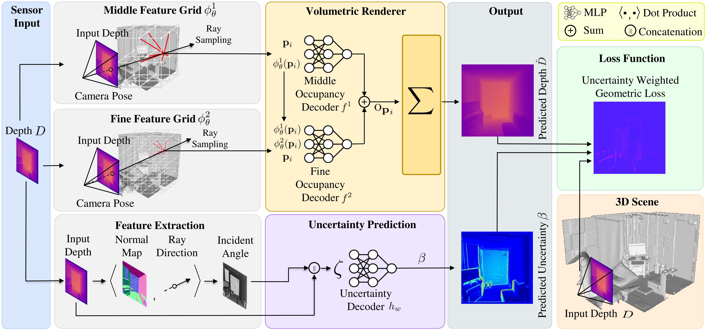
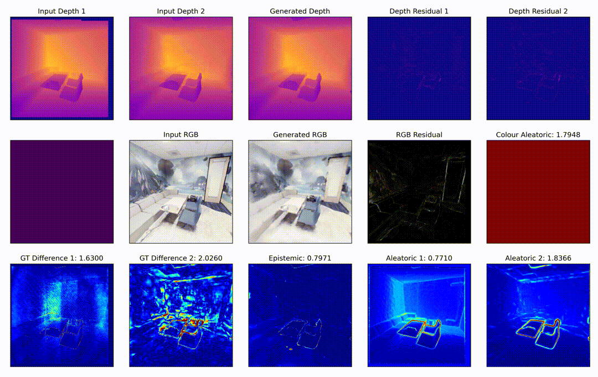
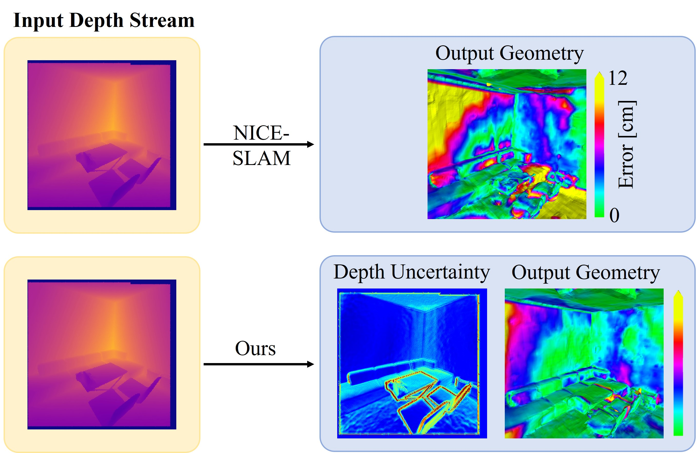

| <h1 align="center">UncLe-SLAM: Uncertainty Learning for Dense Neural SLAM</h1> |
|:-:|
| **[Erik Sandström](https://scholar.google.com/citations?hl=en&user=phiETm4AAAAJ)\*** • **[Kevin Ta](https://kevinta.dev/)\*** • **[Martin R. Oswald](https://scholar.google.com/citations?user=biytQP8AAAAJ&hl=en&oi=ao)** • **[Luc Van Gool](https://scholar.google.com/citations?hl=en&user=TwMib_QAAAAJ)** | 
| **\*** *Equal Contribution* |
| [**[Arxiv]**](https://arxiv.org/abs/2306.11048) |


## Abstract

We present an uncertainty learning framework for dense neural simultaneous localization and mapping (SLAM). Estimating pixel-wise uncertainties for the depth input of dense SLAM methods allows to re-weigh the tracking and mapping losses towards image regions that contain more suitable information that is more reliable for SLAM. To this end, we propose an online framework for sensor uncertainty estimation that can be trained in a self-supervised manner from only 2D input data. We further discuss the advantages of the uncertainty learning for the case of multi-sensor input. Extensive analysis, experimentation, and ablations show that our proposed modeling paradigm improves both mapping and tracking accuracy and often performs better than alternatives that require ground truth depth or 3D. Our experiments show that we achieve a 38% and 27% lower absolute trajectory tracking error (ATE) on the 7-Scenes and TUM-RGBD datasets respectively. On the popular Replica dataset on two types of depth sensors we report an 11% F1-score improvement on RGBD SLAM compared to the recent state-of-the-art neural implicit approaches. 



## Installation

This work was primarily compeleted using `titan_x`|`titan_xp`|`geforce_gtx_titan_x` GPUs supporting CUDA 11.4. We provide the environment used to run our experiments and the instructions for creating a compatible environment.

```bash
conda install -n base conda-libmamba-solver
conda config --set solver libmamba

conda create -n uncle-slam python=3.9
conda activate uncle-slam

# make chanel installation flexible
conda config --add channels nvidia
conda config --add channels pytorch
conda config --add channels conda-forge
conda config --set channel_priority flexible

conda install pytorch==1.12.1 torchvision==0.13.1 cudatoolkit=11.3 -c pytorch
conda install numpy scipy scikit-image matplotlib pyyaml tqdm trimesh colorama rtree
pip install opencv
pip install open3d 
```

```bash
conda env create -f uncle-slam.yaml
conda activate uncle-slam
```

## Operation

To run uncle-slam, you simply need to pass in the respective `yaml` configuration. We provide configurations for the settings evaluated in this work (`Replica`[SenFuNet], `7Scenes`, `TUM-RGBD`).

```bash
python -u -W ignore run.py configs/Replica_SenFuNet/office0.yaml
```



## Datasets

Datasets should be placed in a `Datasets` folder within the root folder.

### Replica

We use the simulated sensor / depth estimation data from [SenFuNet](https://github.com/eriksandstroem/SenFuNet). You can refer to instructions in that repository.

 [**room 0**](https://data.vision.ee.ethz.ch/esandstroem/replica/room_0.tar) | [**room 2**](https://data.vision.ee.ethz.ch/esandstroem/replica/room_2.tar) | [**office 0**](https://data.vision.ee.ethz.ch/esandstroem/replica/office_0.tar) | [**office 1**](https://data.vision.ee.ethz.ch/esandstroem/replica/office_1.tar)

### 7-Scenes

You can download the 7-Scenes dataset from its [project website](https://www.microsoft.com/en-us/research/project/rgb-d-dataset-7-scenes/). You can place the `.zip` files in `Datasets/7-Scenes/`and then run the following command:

```bash
chmod +x scripts/extract_nested_zip.sh
scripts/extract_nested_zip.sh Datasets/7-Scenes
```

### TUM-RGBD

We use the same script as in NICE-SLAM.

```bash
bash scripts/download_tum.sh
```

## Evaluation



We use a combination of different evaulation approaches, which we provide as utilities in this codebase. You will have to prepare the data for evaluation, including mesh culling and cleaning, as well as viewpoint masking to ensure comparable and informative metrics.

```bash
CONFIG=configs/Replica_SenFuNet/office0.yaml
REC_PATH=output/Replica_SenFuNet/office_0/1/
REC_MESH=output/Replica_SenFuNet/office_0/1/mesh/final_mesh_eval_rec.ply
GT_MESH=Datasets/Replica_SenFuNet/cull_mesh/office_0.ply

python src/tools/eval_f1.py $CONFIG --rec_path $REC_PATH
python src/tools/eval_ate.py $CONFIG
python src/tools/eval_recon_cpu.py $CONFIG --rec_mesh $REC_MESH --gt_mesh $GT_MESH -3d -2d
```

You can reuse the same evaluation methodology from [NICE-SLAM](https://github.com/cvg/nice-slam/) for 3D (accuracy, completion, and completion ratio) metrics and 2D (depth rendering residuals) metrics:

```bash
python src/tools/eval_recon_cpu.py configs/Replica_SenFuNet/office0.yaml --rec_mesh output/Replica_SenFuNet/office_0/1/mesh/final_mesh_eval_rec.ply --gt_mesh Datasets/Replica/cull_mesh/office0.ply -3d -2d

accuracy:  10.955764521327433
completion:  3.910518238086478
completion ratio:  77.034
Depth L1:  5.9660520404577255
```

We also leverage their provided ATE evaluation:

```bash
python src/tools/eval_ate.py $CONFIG

Get ckpt : output/Replica_SenFuNet/office_0/1/ckpts/00441.tar
{'compared_pose_pairs': 442, 'absolute_translational_error.rmse': 0.11628699235386263, 'absolute_translational_error.mean': 0.10003707770662722, 'absolute_translational_error.median': 0.08596961841617533, 'absolute_translational_error.std': 0.05928952415583667, 'absolute_translational_error.min': 0.0, 'absolute_translational_error.max': 0.24728239693637982}
```

Results reported, however, utilize the [`evaluate_3d_reconstruction_lib`](https://github.com/eriksandstroem/evaluate_3d_reconstruction_lib/) to get accuracy, precision, and F1 score for a balanced presentation of results.

```bash
python src/tools/eval_f1.py $CONFIG --rec_path $REC_PATH

==============================
evaluation result : office_0
==============================
distance tau : 0.050
precision : 0.7399
recall : 0.7670
f-score : 0.7532
==============================
precision statistics
min: 0.0002
max: 0.5511
mean: 0.0432
median: 0.0246
std: 0.0545
==============================
recall statistics
min: 0.0001
max: 0.5167
mean: 0.0384
median: 0.0239
std: 0.0423
==============================
```

## Acknowledgements

This code was built off of the incredible work done by [Zihan Zhu](https://zzh2000.github.io/) and [Songyou Peng](https://pengsongyou.github.io/) in [NICE-SLAM](https://github.com/cvg/nice-slam/), without whose efforts this work would not be possible. Their work further builds on others' works and we gratefully acknowledge all of the efforts of all contributors, from dataset creators, library maintainers, and fellow researchers.

## Citation

```bibtex
@inproceedings{
uncleslam2023,
title={Uncle-{SLAM}: Uncertainty Learning for Dense Neural {SLAM}},
author={Sandström, Erik and Ta, Kevin and Gool, Luc Van and Oswald, Martin R.},
booktitle={International Conference on Computer Vision Workshops (ICCVW),
year={2023},
}
```

